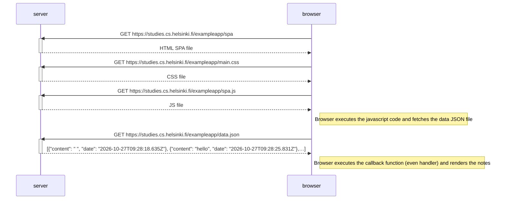

```mermaid

    sequenceDiagram 
    participant server
    participant browser

    browser->>server: GET https://studies.cs.helsinki.fi/exampleapp/spa
    activate server
    server-->>browser: HTML SPA file
    deactivate server

    browser->>server: GET https://studies.cs.helsinki.fi/exampleapp/main.css
    activate server
    server-->>browser: CSS file
    deactivate server

    browser->>server: GET https://studies.cs.helsinki.fi/exampleapp/spa.js
    activate server
    server-->>browser: JS file
    deactivate server

    Note right of browser: Browser executes the javascript code and fetches the data JSON file

    browser->>server: GET https://studies.cs.helsinki.fi/exampleapp/data.json
    activate server
    server-->>browser: [{"content": " ", "date": "2026-10-27T09:28:18.635Z"}, {"content": "hello", "date": "2026-10-27T09:28:25.831Z"},…]
    deactivate server 

    Note right of browser: Browser executes the callback function (even handler) and renders the notes

```
    